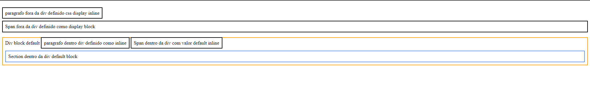

# Conceitos - CSS

## Tudo é uma caixa no CSS

Por padrão todo elemento `HTML` tem um valor display default existem dois tipos, `block` e `inline`.
O nome disso em css é box model.

>Image by [learntheweb](https://learntheweb.courses/)

Verifique os tipos de elemento inline e block conforme o [w3schools](https://www.w3schools.com/html/html_blocks.asp)

Exemplo [display inline e block](./box_css.html).

Resultado código acima.

## Referências 

[Everything is a box](https://learntheweb.courses/topics/box-model/#:~:text=Every%20single%20thing%20you%20target,the%20style%20of%20each%20box.)
[Introduction to the CSS basic box model](https://developer.mozilla.org/en-US/docs/Web/CSS/CSS_box_model/Introduction_to_the_CSS_box_model)
